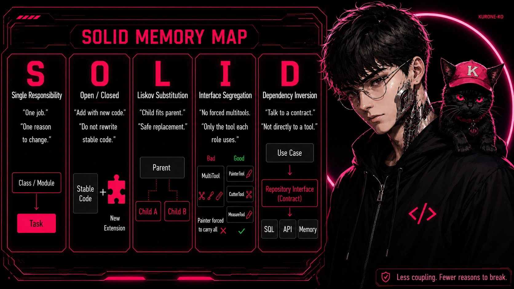
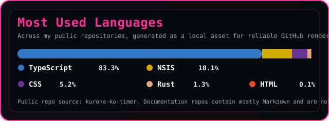

  

  

<h1 align="center">
What should a developer really focus on today?
</h1>

I am learning software development by focusing less on chasing tools and more on understanding the fundamentals behind them: architecture, clean code, problem solving, UX, and the decisions that make software easier to maintain.

That is why I am building my <a href="https://github.com/DevMPoveaCL/software-engineering-playbook"><b>Software Engineering Playbook</b></a>, a living repository where I organize what I learn while trying to study software engineering with more intention.

  
  

  

