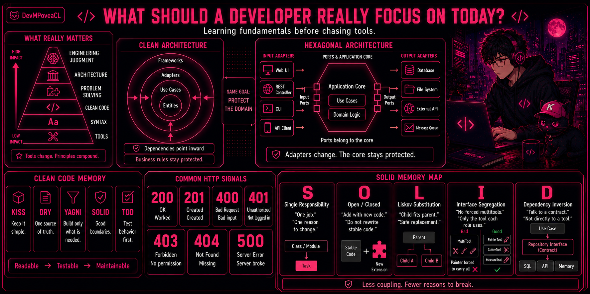

  

<h1 align="center">
What should a developer really focus on today?
</h1>

That question has been on my mind a lot lately.

A few years ago, I started getting into software development almost by accident. It began as a hobby, with curiosity, experiments, broken things, small wins, and a very messy way of learning, probably like many people at the beginning.

At some point, I started looking at job postings, and I noticed a pattern that kept repeating itself. I would see a stack being requested, start learning it so I could apply, and then, along the way, more requirements would appear. Another tool. Another framework. Another way of doing things.

And little by little, studying started to feel inefficient.

Not because learning was the problem, but because I felt like I was constantly chasing technologies instead of truly understanding what I was building.

Over time, and probably because of how much the industry itself is changing, I started feeling that the real focus has to be somewhere deeper.

Not just <i>which</i> tool you use, but <b>why</b> you use it. 
Not just how to follow a tutorial, but how to think through a solution. 
Not just how to make something work, but how to make it clear, maintainable, and useful.

That shift is what led me to start writing things down.

Notes, experiments, concepts I wanted to understand better, mistakes I did not want to repeat, and small lessons from the process of learning software with more intention.

That is where my repository ✨ <a href="https://github.com/DevMPoveaCL/software-engineering-playbook"><b>Software Engineering Playbook</b></a> ✨ comes from.

It is a living space where I organize what I am learning across software engineering: from the basics to architecture, clean code, frontend, backend, infrastructure, UX, accessibility, and the fundamentals that connect everything together.

It is not meant to be a place where I pretend to know everything.

It is more like a map of the road I am walking, built slowly, honestly, and with the hope that it may also help someone else who feels overwhelmed by the same noise of tools, stacks, and endless requirements.

If any of this resonates with you, or if you are also learning, building, or trying to understand software beyond the surface, I would be happy to connect on <a href="https://www.linkedin.com/in/marco-povea-b21038258/">LinkedIn</a>.

✨ Thanks for stopping by ✨

